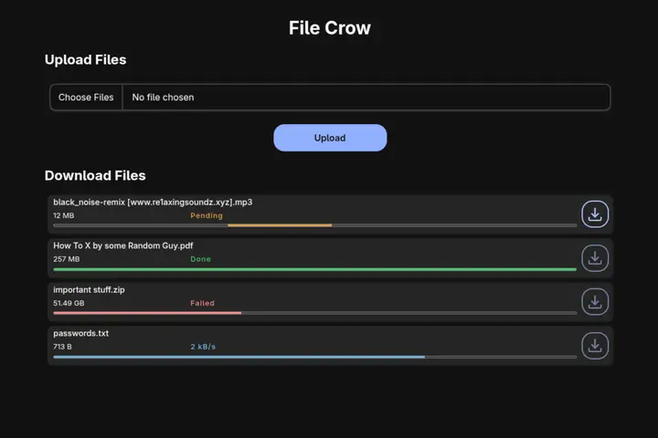

# File Crow

A peer-to-peer file server for sharing files over a local network.



## Motivation

I often transfer files between my PC and mobile device using a USB cable. But every time I want to share something I have to take the cable out of the charger and connect both devices. So I built File Crow to share files over the local network.

## Quick Start

### Requirements

- [Go](https://go.dev/doc/install) v1.25.5 or higher
- [Node](https://nodejs.org/en/download) v24.15 or higher
- [pnpm](https://pnpm.io/installation) v11.9 or higher

1. Install filecrow

```bash
# clone the repo
git clone https://github.com/syeero7/filecrow
cd filecrow

# install dependencies and build the compiled binary
chmod +x build.sh
./build.sh
```

2. Start the file server

```bash
./bin/filecrow
```

3. Access the web ui at `http://localhost:<PORT>` on the host device. The default port is 8080.

4. On other devices, access via `http://<DEVICE_IP>:<PORT>`.

5. Upload files to share from any device and download them on other devices.

## Usage

Available flags:

- `--port` - The port number to run the server on (default 8080)
- `-h`, `--help` - Show help

### Examples

```bash
# Start with a custom port
filecrow --port 8000
```

## Contributing

### Clone the repo

```bash
git clone https://github.com/syeero7/filecrow
cd filecrow
```

### Build the compiled binary

```bash
chmod +x build.sh
./build.sh
```

### Submit a pull request

If you'd like to contribute, please fork the repository and open a pull request to the `main` branch.
